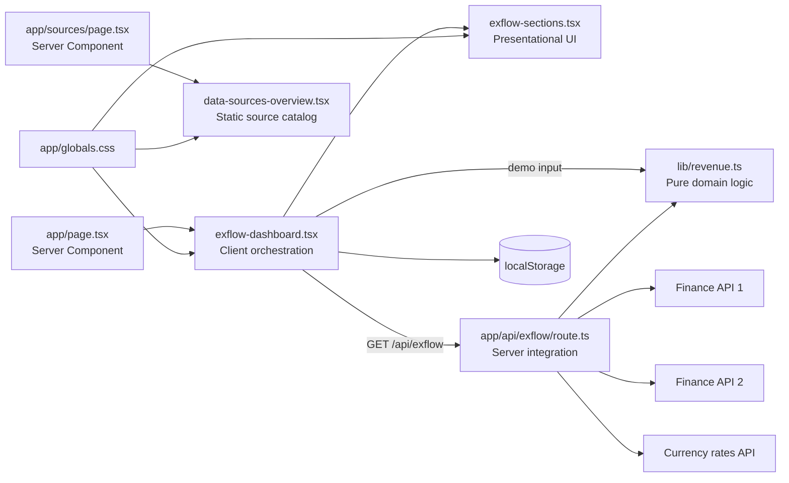
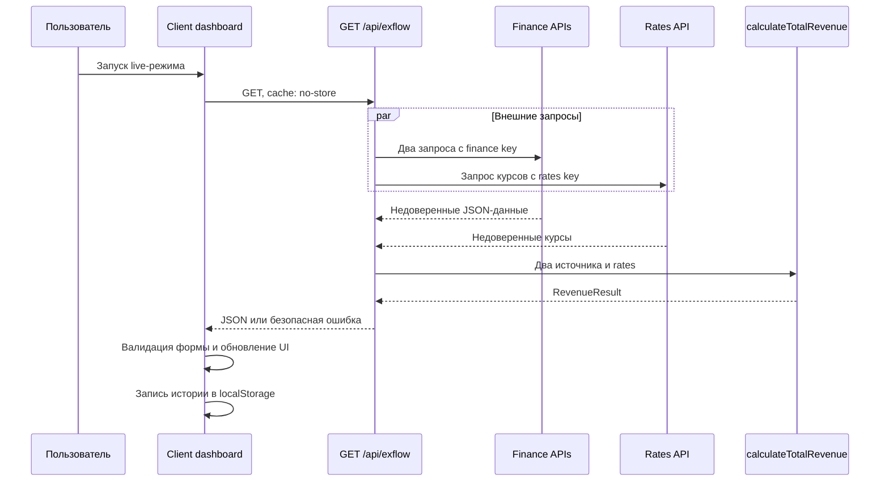

# Архитектура и структура проекта ExFlow

## Назначение документа

Документ описывает текущее устройство ExFlow, ответственность модулей и основные потоки данных. Используй его перед архитектурным анализом, добавлением нового слоя, перемещением файлов или изменением взаимодействия между клиентом, API и финансовой логикой.

Обновляй документ вместе с кодом, если меняются структура каталогов, границы server/client, публичные внутренние контракты, хранение состояния, внешние интеграции или процесс развёртывания.

## Назначение приложения

ExFlow — одностраничный русскоязычный финансовый dashboard. Приложение:

- получает финансовые данные из двух внешних API;
- выбирает оплаченные и корректно сформированные операции;
- получает актуальные валютные курсы;
- конвертирует суммы в USD;
- показывает общий итог, вклад каждого источника и качество обработки;
- поддерживает live-режим и локальный demo-режим;
- сохраняет в браузере историю последних расчётов.

## Технологический контур

| Область | Технология | Роль |
| --- | --- | --- |
| Framework | Next.js 16, App Router | Маршрутизация, Server/Client Components и Route Handler |
| UI runtime | React 19 | Интерактивное состояние dashboard |
| Язык | TypeScript 5, strict mode | Контракты и статическая проверка |
| Стили | Tailwind CSS 4 и `app/globals.css` | Utilities, тема и компонентные стили |
| Package manager | Bun 1.2.15 | Установка зависимостей и запуск scripts |
| Проверка | ESLint и `next build` | Статика и production-сборка |
| Развёртывание | Multi-stage Dockerfile на Bun | Сборка и запуск server-rendered приложения |

## Структура каталогов

```text
my-app/
├── .codex/
│   ├── rules/                   # Тематические инструкции для Codex
│   └── skills/
│       └── audit-financial-api/ # Аудит live API и отчёты для backend
├── docs/
│   └── project-architecture.md  # Этот документ
├── app/
│   ├── api/
│   │   └── exflow/
│   │       └── route.ts         # Серверная live-агрегация
│   ├── favicon.ico
│   ├── globals.css              # Глобальная тема и UI-стили
│   ├── layout.tsx               # Root layout и metadata
│   ├── page.tsx                 # Главная страница
│   └── sources/
│       └── page.tsx             # Описание источников данных
├── components/
│   ├── data-sources-overview.tsx # Статическая страница источников
│   ├── exflow-dashboard.tsx     # Клиентское состояние и действия
│   └── exflow-sections.tsx      # Presentational-секции dashboard
├── lib/
│   └── revenue.ts               # Чистая финансовая логика
├── public/                      # Статические файлы
├── .env.example                 # Шаблон серверных env-переменных
├── AGENTS.md                    # Маршрутизатор проектных правил
├── CLAUDE.md                    # Ссылка на AGENTS.md для другого агента
├── Dockerfile                   # Production container
├── README.md                    # Запуск и развёртывание
├── bun.lock                     # Зафиксированные Bun-зависимости
├── eslint.config.mjs
├── next.config.ts
├── package.json
├── postcss.config.mjs
└── tsconfig.json
```

`node_modules`, `.next`, `next-env.d.ts` и `*.tsbuildinfo` являются зависимостями или generated artifacts и не входят в поддерживаемую вручную архитектуру.

## Архитектурные слои

### 1. App Router shell

Файлы: `app/layout.tsx`, `app/page.tsx`, `app/sources/page.tsx`.

- `layout.tsx` задаёт корневой `<html>`, язык `ru`, metadata и глобальные стили.
- `page.tsx` остаётся тонкой Server Component и монтирует основной dashboard.
- `sources/page.tsx` задаёт metadata маршрута `/sources` и монтирует статическое описание источников данных.
- В shell не размещаются финансовые вычисления, браузерное состояние или авторизованные внешние запросы.

### 2. Клиентская orchestration

Файл: `components/exflow-dashboard.tsx`.

Главный Client Component отвечает за:

- запуск live- и demo-сценариев;
- loading, error, result и mode state;
- проверку формы ответа `/api/exflow`;
- пользовательский журнал и toast-уведомления;
- синхронизацию истории через `localStorage` и `useSyncExternalStore`;
- clipboard и формирование CSV;
- browser-only эффекты и их очистку.

Компонент координирует сценарии, но не должен повторять алгоритм финансового расчёта.

### 3. Presentational UI

Файлы: `components/exflow-sections.tsx`, `components/data-sources-overview.tsx`.

Секции получают подготовленные props и отображают:

- вклад источников;
- статистику обработанных и пропущенных операций;
- обнаруженные валюты;
- историю запусков;
- журнал процесса.

В этом слое не должно быть сетевых запросов, чтения env или реализации конвертации валют.

`data-sources-overview.tsx` статически описывает безопасные публичные сведения об интеграциях и этапах расчёта. Он не выполняет live-запросы и не содержит значений API-ключей.

### 4. Серверная интеграция

Файл: `app/api/exflow/route.ts`.

Route Handler является server-only границей между браузером и внешними сервисами. Он:

- читает приватные API-ключи;
- параллельно запрашивает два финансовых источника и сервис курсов;
- применяет timeout и `no-store`;
- передаёт недоверенные ответы в функцию расчёта;
- преобразует результат или ошибку в безопасный HTTP/JSON-контракт.

В браузер не передаются API-ключи, headers, upstream payload и внутренний stack trace.

### 5. Доменная финансовая логика

Файл: `lib/revenue.ts`.

Слой содержит типы входов и результата, парсинг, нормализацию валют, конвертацию и подсчёт качества данных. `calculateTotalRevenue` является чистой и детерминированной функцией, поэтому одинаково используется live API и demo-режимом.

Этот слой не зависит от Next.js, React, env, сети или browser API.

### 6. Визуальная система

Файл: `app/globals.css` и Tailwind classes внутри компонентов.

`globals.css` содержит:

- подключение Tailwind CSS 4;
- theme tokens шрифтов;
- базовые правила страницы;
- переиспользуемые glassmorphism-компоненты;
- responsive layout;
- animations и reduced-motion overrides.

Локальная компоновка остаётся в JSX utilities, а повторяемые или сложные визуальные примитивы — в component layer `globals.css`.

## Зависимости между слоями



Разрешённое направление зависимостей:

- UI может импортировать типы и чистую функцию доменного слоя.
- Route Handler может импортировать типы и функцию доменного слоя.
- Доменный слой не импортирует UI, Next.js или серверную интеграцию.
- Presentational UI не вызывает API напрямую.
- Клиент никогда не обращается к внешним сервисам с приватными ключами напрямую.

## Live-поток



Характеристики live-потока:

- Route Handler принудительно динамический.
- Upstream и итоговый успешный ответ не кешируются.
- На каждый внешний запрос действует timeout 15 секунд.
- Нет конфигурации — `503`; upstream или parsing failure — `502`.

## Demo-поток

Demo-режим не вызывает сеть:

1. Client Component берёт встроенные примеры двух источников и курсов.
2. Вызывает ту же `calculateTotalRevenue`, что используется live route.
3. Обновляет результат, журнал и историю по общему клиентскому сценарию.

Благодаря общему доменному слою demo проверяет реальную логику расчёта, а не отдельную имитацию результата. Demo должен оставаться доступным без env и сетевого подключения.

## Внутренние контракты данных

### Первый источник

Ожидается объект с необязательным массивом `transactions`. У транзакции могут присутствовать `type`, `amount` и `currency`, но удалённые значения считаются `unknown` до проверки.

Учитывается только операция, где:

- `type` равен `paid` без учёта регистра;
- `amount` — конечное число;
- `currency` — непустой код валюты.

### Второй источник

Ожидается массив неизвестных элементов. Корректной считается строка формата `<положительная сумма> <трёхбуквенный код>`, например `680 USD`.

### Курсы

Курсы представлены как `Record<string, string | number>`. Для валюты кроме USD значение приводится к числу и должно быть конечным и больше нуля. Сумма в исходной валюте делится на курс с базой USD.

### Результат

`RevenueResult` содержит:

- `total` — итог, округлённый до двух знаков;
- `currency` — всегда `USD`;
- `processed` — число учтённых операций;
- `skipped` — число отброшенных операций;
- `currencies` — отсортированные обнаруженные коды;
- `warnings` — уникальные предупреждения;
- `sources` — подытоги двух источников.

При изменении этого контракта необходимо синхронно обновить доменный тип, API, клиентскую runtime-проверку, presentational components и этот документ.

## Клиентское хранение

История хранится только в браузере:

- основной ключ — `exflow-history`;
- legacy fallback — `finora-history`;
- сохраняются последние шесть записей;
- server snapshot для hydration — пустой JSON-массив;
- запись уведомляет подписчиков через локальное событие `exflow-history-change`.

Содержимое storage недоверенное и должно защитно разбираться. Изменение ключа или формы записи требует миграции.

## Конфигурация и секреты

`.env.example` описывает два server-only значения:

```env
EXFLOW_FINANCE_API_KEY=your_finance_api_key
EXFLOW_RATES_API_KEY=your_currencyfreaks_api_key
```

Настоящие значения находятся в `.env.local` или настройках hosting и не коммитятся. Префикс `NEXT_PUBLIC_` для них запрещён, поскольку он включил бы значения в клиентский bundle.

## Сборка и развёртывание

Основные scripts:

```bash
bun run dev
bun run lint
bun run build
bun run start
```

Dockerfile использует три стадии:

1. `dependencies` — установка по `bun.lock` с `--frozen-lockfile`;
2. `build` — production build Next.js;
3. `production` — запуск собранного server-rendered приложения через Bun.

Приложению нужен hosting с поддержкой Next.js server runtime и исходящих HTTPS-запросов. Обычный статический hosting не поддерживает live route.

## Правила размещения нового кода

| Новый код | Рекомендуемое место |
| --- | --- |
| Чистая финансовая функция или тип | Корневой `lib/` |
| Новый browser-independent helper | Корневой `lib/`, если он относится к домену; иначе отдельный тематический `lib`-модуль |
| Авторизованный внешний запрос | Server-only модуль или `app/api/**/route.ts` |
| Новый HTTP endpoint | `app/api/<name>/route.ts` |
| Интерактивное UI-поведение | Небольшой файл в корневом `components/` с `"use client"` |
| Статическая секция интерфейса | Server или presentational component без client directive |
| Общий визуальный примитив | `app/globals.css` в подходящем layer |
| Документация архитектурного решения | `docs/` и ссылка из этого документа |
| Проектный повторяемый workflow агента | `.codex/skills/<skill-name>/` |

Не создавай новый слой только ради одного короткого helper. Выделяй модуль, когда у него появляется отдельная ответственность, независимая проверка или повторное использование.

## Обязательное обновление документа

Обнови `docs/project-architecture.md` в той же задаче, если:

- добавлен или удалён архитектурно значимый каталог или модуль;
- изменилось направление зависимостей между UI, API и доменом;
- изменился live- или demo-поток;
- изменился `RevenueResult` или формат входных источников;
- изменились env, внешние интеграции, caching, HTTP-статусы или storage;
- изменился процесс сборки и развёртывания.

Косметическое изменение текста или локального CSS, не меняющее архитектуру, не требует обновления этого документа.
